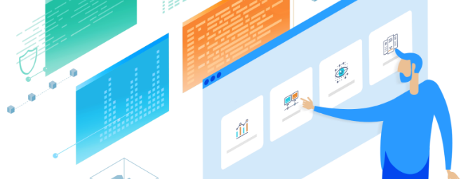

---
@title[Demo]

---
@title[Rundeck]
## ¿Qué es Rundeck?

 

Rundeck es una herramienta de automatización.
Permite la ejecución y orquestación de scripts y comandos en equipos remotos.

---
@title[Funcionamiento]

## ¿Cómo funciona?

 

- Linux: SSH |
- Windows: Powershell Node Executor |

---
@title[Por_que_Rundeck]

## ¿Por qué Rundeck?

- Interfaz web |
- Supervisión de ejecución |
- Historial y Estadísticas |
- Control de acceso (ACL y AD) |
- Notificaciones |
- Plugins |

---
@title[Organización]

### Organización

+++
@title[Actividad]

### Actividad

+++
@title[Estado]

### Estado

+++
@title[Estadísticas]

### Estadísticas

---
@title[Ejemplos]

# Ejemplo Tarea Automatizada

+++?video=https://raw.githubusercontent.com/coneking/rundeck/demo/videos/rundeck_rec.mp4
@title[Rundeck]

---
@title[Integracion]

## Integración Portal de Servicios

---
@title[API]

## ¿Cómo lograr la integración?

API |

---
@title[Ejemplo_portal]

# Ejemplo de integración

+++?video=https://raw.githubusercontent.com/coneking/rundeck/demo/videos/rundeck_rec2.mp4
@title[Rundeck_Portal]

---
@title[Automatiza]

## Hora de automatizar...

